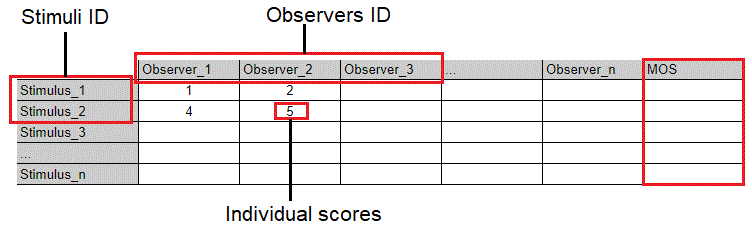
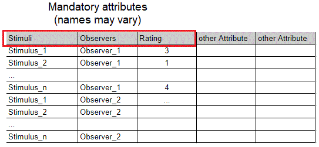

# Source code for the project : Video quality and metrics

## Introduction

This project is part of the Transversal projects (PTRANS) organized by the Graduate School of Engineering of the University of Nantes, [Polytech Nantes](http://www.polytech.univ-nantes.fr/) that happened throughout the year 2021-2022. 

This project involved three 4th year students of the school :
- [Chama El Majeny](https://www.linkedin.com/in/chama-el-majeny-0642591bb/)
- [Yvann Gouraud](https://www.linkedin.com/in/yvann-gouraud-6a5388209/)
- [Jiawen Liu](https://www.linkedin.com/in/jiawen-liu-00bb6b225/)

They worked on a project under the tutelage of Professor Patrick Le Callet from Polytech Nantes.

This project was commissioned by Doctor Margaret H.Pinson from the Institute for Telecommunication Sciences (ITS), the research branch of the National Telecommunications and Information Administration (NTIA).

The aim of this project was to provide a centralized tool that could analyze datasets obtained from subjective test quality assessment. Our tool can run several statistical analysis such as calculating the average MOS of each stimulus, and calculating the precision of the dataset using methods developed by Doctor Pinson and Ms Yana Nehmé.

## Needed libraries 

First, in order to run the tool, a user needs to import all the necessary packages :
- pandas : used for data manipulation
- tkinter : used to create the Graphical User Interface
- matplotlib : used for statistical tools and data visualization
- numpy : used for statistical tools
- scipy : numpy’s extension, used for statistical functions
- pandastable : used to get a preview of the dataset in the GUI
- xlrd

This can be done easily by running the python file : import_file.py. This file will automatically import all of the necessary packages which can take a couple minutes.

## Data input

The User can either choose to conduct analysis on one of the datasets that are already present in the tool (University of Nantes datasets) or to input their own datasets.
To find a list of all of the datasets available, see : 

Since it was very difficult to create a universal parser for the datasets, we decided to transform all of the dataset in one format. We called it our Standard Format. Of course, we can’t assume that all the dataset input in our system will have the right format. Thus we have also accepted an alternative format. The user simply needs to input some more information together with the dataset. 

### Format 1: Standard format
In this format, observers' ratings of each individual stimuli are presented like a matrix. For example, the highlighted cell represents the score given by observer 2 for the second Stimulus.
This format can be directly entered into the system for analysis.

The first column gives the names of all stimuli, no column names are required for this column. There are no requirements for stimuli names.
The last column name is MOS (Mean Opinion Score).
Each remaining column represents an observer. The number of columns can vary depending on the number of observers.

Fig 1 : Example for format 1

### Format 2: Other format
In this format, each row records an observational experiment and it contains all the data generated for an experiment performed by an observer.
The data in this format needs to be converted into our standard format and then entered into the system for analysis. Thus, we need some more information to change the data structure.

Three columns are necessary: observer, stimulus name, score.

The datasets can contain additional attribute columns (but these attributes will be ignored).

There is no requirement for column names, but you need to enter the column name information during the format conversion step.

Fig 2 : Example for format 2

To fill in the information necessary, the user will be presented with the following screen :
On the left hand side, you can see a view of the dataset that the user is inputting. On the right hand side, the user can change the sheet number of the document which can be useful if several datasets are contained within the same excel file for example. 
To select the column names, the user needs to click first on the cell that contains the name of the column and then click the button corresponding on the right. A checkbox then appears to signal that the name was selected. In this case, the user could click on the TestSubject cell to select it and then click on the “Name of the observer column”.

The transformation is then done by our tool using the transformData.py file.

## Statistical tools

### Mean Opinion Score (MOS)
For each stimulus, the tool computes the Mean Opinion Score which is the average rating given by the observers.

Output table

### Standard Deviation of MOS
This tool shows how the standard deviation of MOS changes as the number of observers increases

Output chart:

X-axis: 
is the number of observers participating in the analysis. The system will automatically select the appropriate abscissa spacing based on the total number of observers in the input dataset.
The last abscissa will be the total number of observers in the input dataset.
Y-axis: 
Standard Deviation of MOS
The width of the image
It represents the distribution interval of the standard deviation of MOS.

### Confidence interval
The Confidence Interval is a statistical tool developed by Yana Nehme in  “Exploring Crowdsourcing for Subjective Quality Assessment of 3D Graphics”. The Confidence Intervals tool analyzes the change in the 95% confidence interval of the subjective test experimental scores which are tested with different numbers of observers. 
It shows the distribution of the Confidence Interval Width for different group sizes. The system will sample the observers of the input dataset to form many unique groups (maximum 200 groups), with specific group size and unique combinations. Then the system will calculate the confidence interval width of these sampling groups one by one, and then draw them into a box plot.

Output chart:

X-axis: The number of observers participating in the analysis. The system will automatically select the appropriate abscissa spacing based on the total number of observers in the input dataset.
The last abscissa will be the total number of observers in the input dataset.
Y-axis:  Confidence interval width. Because the 95% confidence interval is computed here, the system also directly calculates the standard deviation.

### Accuracy
The Accuracy test is a statistical tool developed by Yana Nehmé as seen in ‘Comparison of subjective methods for quality assessment of 3d graphics in virtual reality’.
This test compares two independent sample groups and can determine if these two groups are statistically different. If the p-value (p) of the Wilcoxon test is < 0.05: Stimulus_1 median note is significantly different from Stimulus_2 median note with a p-value=p.
To study the evolution of the subjective methods’ accuracy based on the number of observers, the Wilcoxon test is done several times with a different number of observers. These observers are randomly chosen within the dataset without repetition or duplication. 
The program then studies the variation of accuracy number of pairs rated significantly different) according to the number of observers and plots the variation of accuracy between the tests.
Output chart:

X-axis: 
The number of observers participating in the analysis. The system will automatically select the appropriate abscissa spacing based on the total number of observers in the input dataset. The last abscissa will be the total number of observers in the input dataset.
Y-axis: 
The number of pairs of stimuli rated significantly different in percentages of the total number
The width of the image
It represents the distribution interval of the accuracy of the different combinations under the current number of observers

### Precision of Subjective Test
The Precision of subjective tests is a statistical tool developed by Margaret H.Pinson as seen in “Confidence Intervals for Subjective Tests and Objective Metrics That Assess Image, Video, Speech, or Audiovisual Quality”.

It uses the Student t-test on all pairs of stimuli A and B, where both stimuli were rated by the same subjects and the stimuli are drawn from the same dataset, to compare their rating distribution at 95% confidence level. For each pair of stimuli is also measured ΔS the absolute value of the distance between the MOSs of A and B.
A new variable π is introduced as the average response of the Student t-test for the population of this subjective test, expressed in percentage. (0% means that all pairs of stimuli have equivalent quality and 100% means that all pairs of stimuli have different quality).

By plotting π as a function of ΔS, the link between the two can be observed. A new measure of the precision of the subjective test is then defined ΔSci : the test subjective CI. It corresponds to the ΔS level that is closest to distinguishing between 95% of all stimuli pairs.

On our tool, the test exists in two different versions made for ACR-5 and ACR-100 respectively.

Output chart

